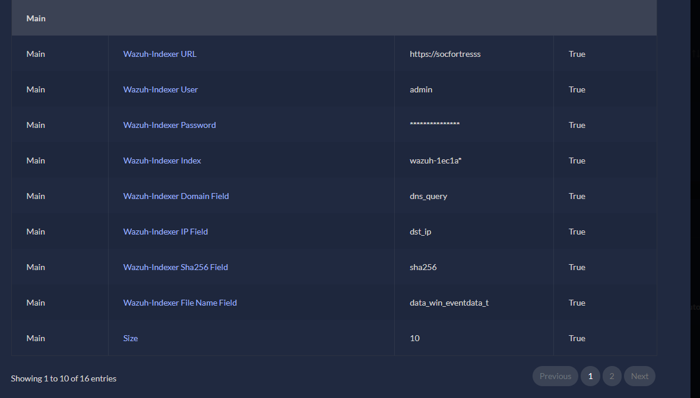
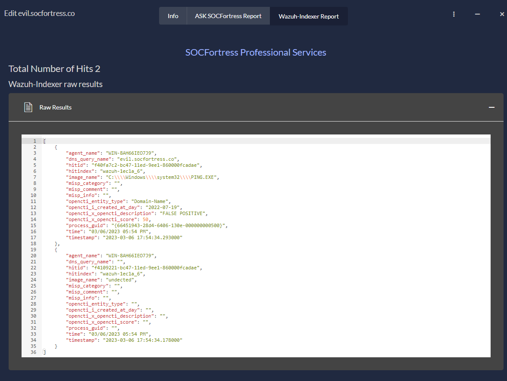
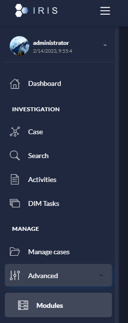
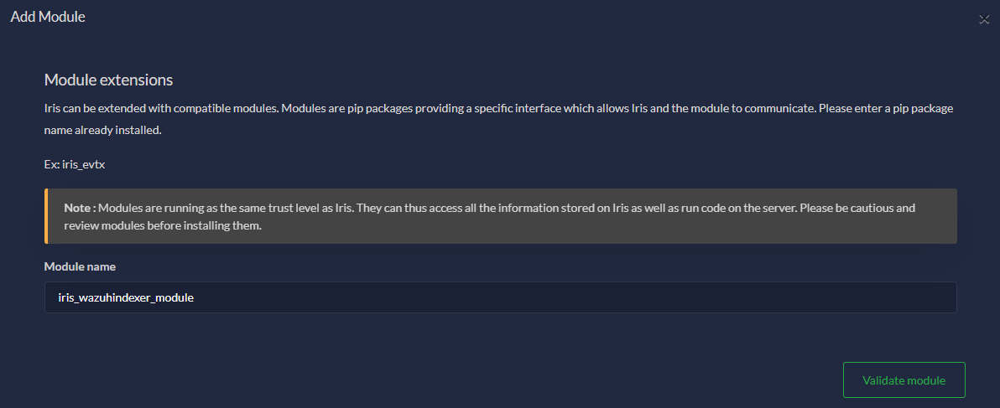
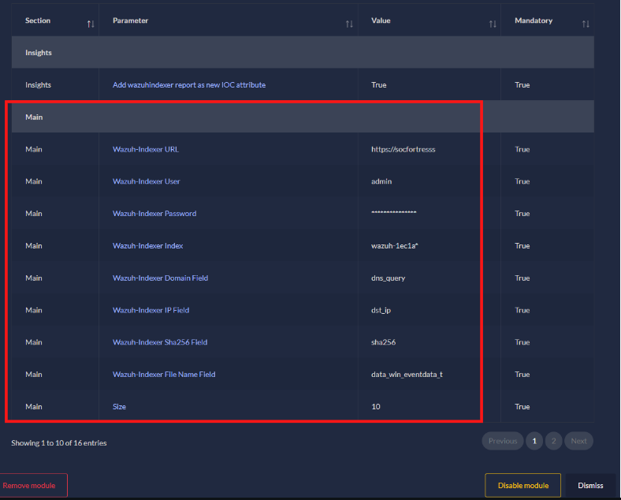
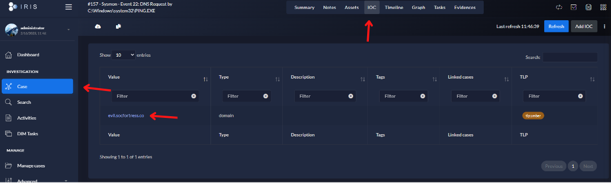
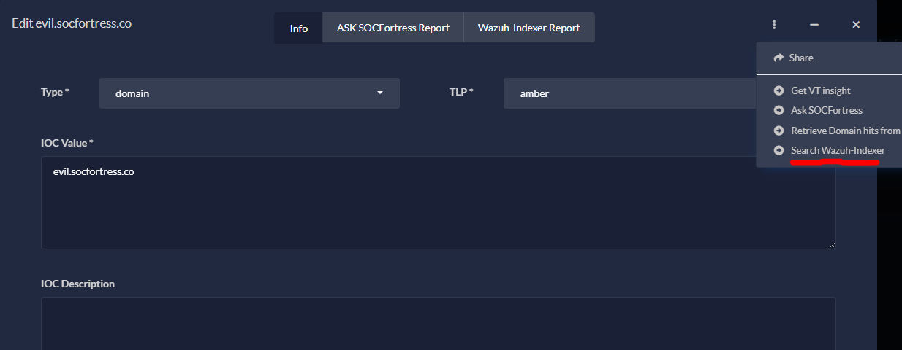

[](https://www.socfortress.co/)

# Wazuh-Indexer Module [](https://www.socfortress.co/trial.html)
> Quickly search your logs with Wazuh-Indexer module to spot IoCs.


[![MIT License][license-shield]][license-url]
[![LinkedIn][linkedin-shield]][linkedin-url]
[](https://youtu.be/2EMb6zYx7_E)
[](https://www.youtube.com/playlist?list=PLB6hQ_WpB6U0WeroZAfssgRpxW8olnkqy)

<!-- PROJECT LOGO -->
<br />
<div align="center">
  <a href="https://www.socfortress.co">
    
  </a>

  <h3 align="center">Wazuh-Indexer</h3>

  <p align="center">
    SOCFortress provided DFIR-IRIS module.
    <br />
    <a href="https://www.socfortress.co/contact_form.html"><strong>Contact SOCFortress »</strong></a>
    <br />
    <br />
  </p>
</div>


<!-- Intro -->
# Intro
## **Currently supports the Wazuh-Indexer and Elasticsearch 7.10.1**</br>
Use the `Wazuh-Indexer` module to quickly search your logs with Wazuh-Indexer module to spot IoCs. This module is designed to help SOC analysts quickly spot any other endpoints that have the same IoCs associated with their ingested events. </br>

The module is built for the below IoC types:
* Ip Address
* Domain
* Sha256 Hash
* Filename

The module can be configured to search any Index and looks for IoCs in the following fields:
* `dns_query`
* `dst_ip`
* `sha256`
* `data_win_eventdata_targetFilename`

**You can configure the module to search any index and any fields you like.** </br>

<div align="center" width="100" height="100">

  <h3 align="center">Configuration</h3>

  <p align="center">
    <br />
    <a href="https://github.com/socfortress/iris-wazuhindexer-module/tree/main/images/config.PNG">
    
    </a>
    <br />
    <br />
  </p>
</div>

<div align="center" width="100" height="100">

  <h3 align="center">Results</h3>

  <p align="center">
    <br />
    <a href="https://github.com/socfortress/iris-wazuhindexer-modul/blob/main/images/evil_socfortress.PNG">
    
    </a>
    <br />
    <br />
  </p>
</div>


<!-- Install -->
# Install
Currently, the Wazuh-Indexer module can be ran as `DFIR-IRIS` Module. </br>

> Get started with DFIR-IRIS: [Video Tutorial](https://youtu.be/XXyIv_aes4w)

### The below steps assume you already have your own DFIR-IRIS application up and running.

1. Fetch the `Wazuh-Indexer Module` Repo
    ```
    git clone https://github.com/socfortress/iris-wazuhindexer-module
    cd iris-wazuhindexer-module
    ```
2. Install the module
    ```
    ./buildnpush2iris.sh -a
    ```

<!-- Configuration -->
# Configuration
Once installed, configure the module to include:
* Wazuh-Indexer Endpoint
* Wazuh-Indexer Username (Read permissions for your desired index required)
* Wazuh-Indexer Password
* Index naming pattern (e.g. `wazuh-alerts*`)
* Fields to search (e.g. `dns_query, dst_ip, sha256, data_win_eventdata_targetFilename`)


1. Navigate to `Advanced -> Modules`

<div align="center" width="100" height="50">

  <h3 align="center">Advanced -> Modules</h3>

  <p align="center">
    <br />
    <a href="https://github.com/socfortress/ASK-SOCFortress/blob/main/images/module_webui.PNG">
    
    </a>
    <br />
    <br />
  </p>
</div>

2. Add a new module

<div align="center" width="100" height="50">

  <h3 align="center">Add a new module</h3>

  <p align="center">
    <br />
    <a href="https://github.com/socfortress/ASK-SOCFortress/blob/main/images/add_module.PNG">
    
    </a>
    <br />
    <br />
  </p>
</div>

3. Input the Module name: `iris_wazuhindexer_module`

<div align="center" width="100" height="50">

  <h3 align="center">Input Module</h3>

  <p align="center">
    <br />
    <a href="https://github.com/socfortress/iris-wazuhindexer-module/blob/main/images/input2_module.PNG">
    
    </a>
    <br />
    <br />
  </p>
</div>

4. Configure the module

<div align="center" width="100" height="50">

  <h3 align="center">Configure Module</h3>

  <p align="center">
    <br />
    <a href="https://github.com/socfortress/iris-wazuhindexer-module/blob/main/images/config_mod.PNG">
    
    </a>
    <br />
    <br />
  </p>
</div>

<!-- Running the module -->
# Running the Module
To run the module select `Case -> IOC` and select the dropdown menu. </br>

> Beta currently supports IoC of type: `ip, domain, sha256, filename`


<div align="center" width="100" height="50">

  <h3 align="center">IoC</h3>

  <p align="center">
    <br />
    <a href="https://github.com/socfortress/ASK-SOCFortress/blob/main/images/ioc.PNG">
    
    </a>
    <br />
    <br />
  </p>
</div>

<div align="center" width="100" height="50">

  <h3 align="center">Run Module</h3>

  <p align="center">
    <br />
    <a href="https://github.com/socfortress/iris-wazuhindexer-module/blob/main/images/running.PNG">
    
    </a>
    <br />
    <br />
  </p>
</div>

> # Refresh the webpage within your browser. 
> Auto refresh is coming soon


# Issues?
> If you are experiencing issues, please contact us at `info@socfortress.co`


<!-- MARKDOWN LINKS & IMAGES -->
<!-- https://www.markdownguide.org/basic-syntax/#reference-style-links -->
[contributors-shield]: https://img.shields.io/github/contributors/socfortress/Wazuh-Rules
[contributors-url]: https://github.com/socfortress/Wazuh-Rules/graphs/contributors
[forks-shield]: https://img.shields.io/github/forks/socfortress/Wazuh-Rules
[forks-url]: https://github.com/socfortress/Wazuh-Rules/network/members
[stars-shield]: https://img.shields.io/github/stars/socfortress/Wazuh-Rules
[stars-url]: https://github.com/socfortress/Wazuh-Rules/stargazers
[issues-shield]: https://img.shields.io/github/issues/othneildrew/Best-README-Template.svg?style=for-the-badge
[issues-url]: https://github.com/othneildrew/Best-README-Template/issues
[license-shield]: https://img.shields.io/badge/Help%20Desk-Help%20Desk-blue
[license-url]: https://servicedesk.socfortress.co/help/2979687893
[linkedin-shield]: https://img.shields.io/badge/Visit%20Us-www.socfortress.co-orange
[linkedin-url]: https://www.socfortress.co/
